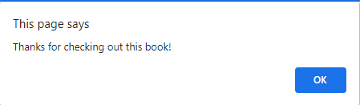

# CS571 Week 02: Badger Bookstore

Welcome to Badger Bookstore! For this assignment, you will be completing the functionality of `app.js` and `helper.js`. Following, you will complete the prototyping assignment in this `README.md`.  **Make sure to complete both the "JavaScript Intermediate Concepts" and "Prototyping" sections.**

## JavaScript Intermediate Concepts

In this assignment, we'll learn more about using APIs via [LoremFlickr](https://loremflickr.com/) (think lorem ipsum for images) and a [custom CS571 API](https://www.coletnelson.us/cs571/f22/hw2/api/book). We'll also learn more about [Bootstrap](https://getbootstrap.com/). The `index.html` and `styles.css` files have already been completed for you. You should **only** modify `app.js` and `helper.js`.


Yes, these are actually the names of songs, but it's the best "dummy" data we've got!

### 1. Loading Featured Book

In `app.js`, use [setAttribute](https://developer.mozilla.org/en-US/docs/Web/API/Element/setAttribute) to set the featured image's `src` attribute to a [150x200 abstract artwork](https://loremflickr.com/150/200/abstract). This will imitate our book cover. The ID for the image element is `featuredBookImage`.

Then, use [fetch](https://developer.mozilla.org/en-US/docs/Web/API/Fetch_API) to retrieve [a single book](https://www.coletnelson.us/cs571/f22/hw2/api/book) from the CS571 API. Extract the name and author of the book to set the contents of `featuredBookName` and `featuredBookAuthor` respectively. An author's full name is the combination of their first and last name.


### 2. Loading Other Books

In `app.js`, use `fetch` to retrieve [12 books](https://www.coletnelson.us/cs571/f22/hw2/api/books?amount=12) from the CS571 API. These books should be inserted into the `allOtherBooks` div. In order to do this, you will have to use a convenience function `constructBook` and a JavaScript function [insertAdjacentHTML](https://developer.mozilla.org/en-US/docs/Web/API/Element/insertAdjacentHTML)^.  

`insertAdjacentHTML` inserts HTML within a div. For example, to insert "hello world" underneath "Other Books", we would write...

```javascript
document.getElementById("allOtherBooks").insertAdjacentHTML('beforeend', '<p>hello world</p>');
```

Use `constructBook` to generate the HTML to be used in `insertAdjacentHTML`. More details on `constructBook` can be found in `helper.js`.


Two things you should notice at this point...
 1. The data here is different than the data in the "featured book" section. That is okay! Sometimes we only use part of the data from an API call, and sometimes we represent data differently.
 2. There are two columns instead of the four shown in the first screenshot. We'll address this with Bootstrap.

 ___

 ^ `insertAdjacentHTML` is an unsafe function that [poses a security risk](https://owasp.org/www-community/attacks/xss/), but that's beyond the scope of this class. All the more reason to use a framework like React!

### 3. Using Bootstrap

Did you notice that things *look prettier*^^ than they did in Badger Bakery? That is because we included [Bootstrap](https://getbootstrap.com/). Bootstrap brings in numerous styles and classes, such as `card`, `row`, and `col` that we can use to style our elements. Among these is an [adaptable grid](https://getbootstrap.com/docs/4.0/layout/grid/) which can be used to change the display on mobile, tablet, and desktop devices.

In `helper.js`, modify `BOOK_HTML` so that a single column of cards is shown on `extra small` and `small` devices, 2 columns are shown on `medium` devices, and 4 columns are shown on `large` and `extra large` devices. You can test this by changing the width of your browser.

#### Extra Small / Small Devices


#### Medium Devices


#### Large / Extra Large Devices


___

^^*look prettier*: a technical term for *visually superior*.

### 4. Checking Out
Finally, a code snippet is provided below that will thank a customer for checking out a book when the checkout button is clicked.

```javascript
document.getElementsByName("checkout").forEach(checkoutBtn => {
    checkoutBtn.addEventListener("click", () => {
        alert("Thanks for checking out this book!");
    });
});
```

In `app.js`, you must add this to your code *in the appropriate place*; appending it to the end of the file will not work! I assure you that this code is correct, but it's in the wrong spot. Move this code snippet to where it belongs.

**Hint:** Think about how the page is loaded. Is everything done synchronously, or is there async behavior going on? When do we know that all the books have been loaded?




## Prototyping

Use [Figma](https://www.figma.com/) to develop a *low-fidelity* prototype of a book checkout system for a desktop (1440x1024) device. You may draw inspiration from this implementation, other implementations, or from your own creativity! The requirements for this are loose, but your prototype must demonstrate the following features...
 1. Be able to view all available books.
 2. Be able to view more details on a book.
 3. Be able to checkout a book and recieve confirmation.

You can assume all browsing is anonymous; there is no need to create a login flow. You must use Figma's "prototype" functionality, e.g. the user of the prototype should be able to use buttons and hyperlinks to navigate rather than arrow keys. Not all buttons and hyperlinks need to be clickable; the prototype only needs to meet the given three requirements.

Please paste a link to your Figma prototype here. **Make sure the link is set to public!** If it is not, we will not be able to access or grade your prototype. You can test this by opening the link in an incognito/private window. Have fun and be creative!
